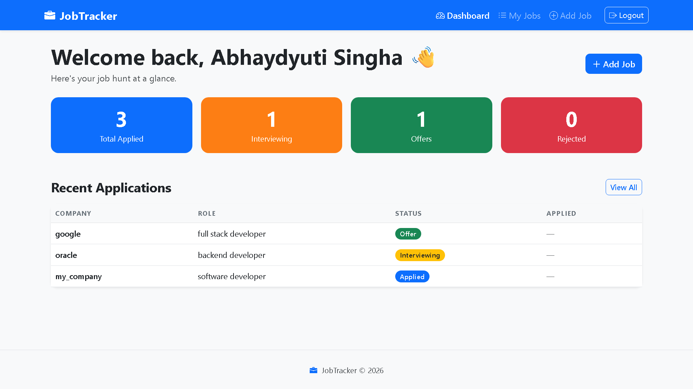

# 💼 Job Application Tracker

A full-stack web application to track your job applications — built with Node.js, Express, PostgreSQL, and EJS.



---

## 🚀 Features

- **User Authentication** — Signup, login, logout with bcrypt-hashed passwords
- **Session Management** — Server-side sessions stored in PostgreSQL
- **Protected Routes** — Middleware-based route protection
- **Full CRUD** — Add, view, edit and delete job applications
- **Filter by Status** — Applied, Interviewing, Offer, Rejected
- **Search** — Find jobs by company name or role
- **Dashboard** — Live counts of applications by status
- **Input Validation** — Server-side validation with express-validator
- **Responsive UI** — Bootstrap 5 with mobile-first design
- **MVC Architecture** — Clean separation of Models, Views, Controllers

---

## 🛠️ Tech Stack

| Layer       | Technology                        |
|-------------|-----------------------------------|
| Runtime     | Node.js                           |
| Framework   | Express.js                        |
| Database    | PostgreSQL                        |
| DB Client   | node-postgres (pg)                |
| Auth        | bcrypt + express-session          |
| Templates   | EJS                               |
| Validation  | express-validator                 |
| Styling     | Bootstrap 5 + custom CSS          |

---

## 📁 Project Structure

```
job-tracker/
├── config/          # Database connection
├── controllers/     # Business logic
├── middleware/      # Auth protection
├── models/          # Database queries
├── routes/          # Route definitions
├── views/           # EJS templates
│   ├── auth/        # Login, Signup
│   ├── jobs/        # Dashboard, List, Add, Edit
│   └── partials/    # Header, Footer
└── public/          # CSS, JS assets
```

---

## ⚙️ Local Setup

### Prerequisites
- Node.js v18+
- PostgreSQL

### 1. Clone the repository
```bash
git clone https://github.com/Abhaydyuti/job-tracker.git
cd job-tracker
```

### 2. Install dependencies
```bash
npm install
```

### 3. Set up the database
```bash
psql -U postgres
```
```sql
CREATE DATABASE job_tracker_db;
\c job_tracker_db

CREATE TABLE users (
  id         SERIAL PRIMARY KEY,
  name       VARCHAR(100) NOT NULL,
  email      VARCHAR(150) UNIQUE NOT NULL,
  password   VARCHAR(255) NOT NULL,
  created_at TIMESTAMP DEFAULT NOW()
);

CREATE TABLE jobs (
  id             SERIAL PRIMARY KEY,
  user_id        INTEGER REFERENCES users(id) ON DELETE CASCADE,
  company_name   VARCHAR(150) NOT NULL,
  role           VARCHAR(150) NOT NULL,
  status         VARCHAR(50) DEFAULT 'Applied',
  applied_date   DATE,
  interview_date DATE,
  notes          TEXT,
  link           VARCHAR(500),
  created_at     TIMESTAMP DEFAULT NOW(),
  updated_at     TIMESTAMP DEFAULT NOW()
);

CREATE TABLE "session" (
  "sid"    VARCHAR NOT NULL COLLATE "default",
  "sess"   JSON NOT NULL,
  "expire" TIMESTAMP(6) NOT NULL,
  CONSTRAINT "session_pkey" PRIMARY KEY ("sid")
);
CREATE INDEX "IDX_session_expire" ON "session" ("expire");
```

### 4. Configure environment variables
```bash
cp .env.example .env
```
Edit `.env` with your PostgreSQL credentials and a session secret.

### 5. Run the app
```bash
npm run dev        # Development (nodemon)
npm start          # Production
```

Visit `http://localhost:3000`

---

## 🔐 Security Highlights

- Passwords hashed with **bcrypt** (10 salt rounds)
- Sessions stored server-side — cookie holds only a session ID
- All SQL queries use **parameterized statements** (prevents SQL injection)
- All DB queries scoped to `user_id` (prevents horizontal privilege escalation)
- Vague login errors prevent **user enumeration**
- `httpOnly` cookies prevent client-side JS access
- `secure` cookies enforced in production (HTTPS only)

---

## 🌐 Deployment

This app is deployment-ready for [Render](https://render.com):

1. Push code to GitHub
2. Create a new **Web Service** on Render, connect your repo
3. Create a **PostgreSQL** database on Render
4. Set environment variables: `DATABASE_URL`, `SESSION_SECRET`, `NODE_ENV=production`
5. Run the SQL schema on the Render database console
6. Deploy ✅

---

## 🙋 Author

**Your Name**
[GitHub](https://github.com/Abhaydyuti) · [LinkedIn](https://linkedin.com/in/abhaydyuti)

## 🌐 Live Demo

👉 [https://job-tracker-rafn.onrender.com](https://job-tracker-rafn.onrender.com)